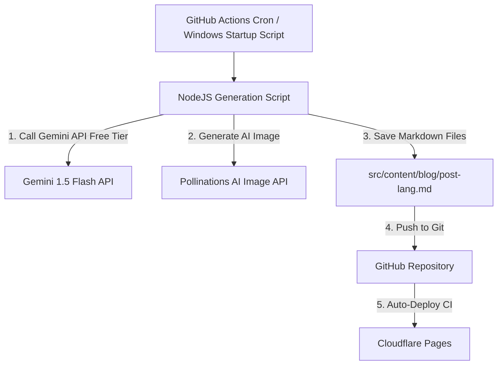

# Implementation Plan — Automated Multilingual AI Blog Generator

We will implement a fully automated blog generator system that writes, translates (English, Hindi, Marathi), formats, generates images for, and publishes SEO-optimized blog posts to `https://free-website-ee9.pages.dev/blog`.

This plan covers setting up the website blog pages (SSG) and the automation scripts/workflows for a **100% free ($0/month)** solution.

---

## Proposed Architecture

### Free Tier & Quota Verification
- **AI Content Generator**: Google Gemini 1.5 Flash via Google AI Studio. 
  - *Pricing page*: https://aistudio.google.com/
  - *Limits*: 15 Requests Per Minute (RPM), 1500 Requests Per Day (RPD).
  - *Card required*: No.
  - *Cost*: $0.
- **Images**: Pollinations AI (Text-to-Image Generation).
  - *Limits*: Unlimited free requests.
  - *Card required*: No.
  - *Cost*: $0.
- **Auto-Publishing**: GitHub Actions workflow.
  - *Limits*: Unlimited runs/minutes for public repositories (2,000 mins/mo for private).
  - *Card required*: No.
  - *Cost*: $0.

---

## Proposed Changes

### Component 1: Astro Blog Pages (Frontend)

We need to implement the user-facing blog routes.

#### [NEW] [index.astro](file:///d:/Agromate/free_website/src/pages/blog/index.astro)
- Displays all published, non-draft blog posts.
- Responsive, premium grid layout matching the global site theme.
- Includes a **Language Switcher** (All, English, Hindi, Marathi) and **Tag Filter**.
- Fast static loading utilizing Astro's Content Collections.

#### [NEW] [\[slug\].astro](file:///d:/Agromate/free_website/src/pages/blog/[slug].astro)
- Renders full markdown posts using `<Content />`.
- Premium design with title, hero image, date, reading time calculation, and tags.
- SEO features: Canonical URLs, schema.org tags, and social Open Graph meta tags.
- Language link to view the post in other available languages.

---

### Component 2: AI Generation Automation (Backend Script)

We will build a dependency-free Node.js generator script that uses the native `fetch` API.

#### [NEW] [generate-blog.js](file:///d:/Agromate/free_website/scripts/generate-blog.js)
- Takes arguments for `--topic` (optional), `--level` (global/local/state/city), and `--location` (e.g. Maharashtra, Mumbai).
- Fetches relevant themes or runs a prompt with Gemini to generate interesting topics.
- Calls Gemini 1.5 Flash to generate a blog post in **English**, **Hindi**, and **Marathi** with:
  - Title & Meta description (optimized for SEO).
  - High-quality content in markdown format.
  - Recommended image prompts.
- Calls Pollinations AI with the generated image prompt to fetch custom hero images.
- Saves files as `src/content/blog/{slug}-{lang}.md`.

---

### Component 3: Scheduler Workflows

We will configure both cloud and local options for automatic execution.

#### [NEW] [auto-blog.yml](file:///d:/Agromate/free_website/.github/workflows/auto-blog.yml)
- GitHub Actions workflow running on a daily cron schedule (and on-demand).
- Calls `scripts/generate-blog.js` using Node.js.
- Uses `GEMINI_API_KEY` stored in GitHub Secrets.
- Commits new posts back to the repo, triggering a Cloudflare Pages deployment automatically.

#### [NEW] [run-on-startup.bat](file:///d:/Agromate/free_website/scripts/run-on-startup.bat)
- A Windows batch script for the local laptop startup trigger.
- Performs `git pull`, runs `node scripts/generate-blog.js`, commits, and pushes to Git.
- Instructions on how to add this to the Windows Task Scheduler or Windows Startup folder will be documented.

---

## Open Questions

> [!IMPORTANT]
> **1. Where would you like Gemini to get its topics from?**
> - **Option A**: Fully autonomous (Gemini comes up with random topics based on local/global news, tech, or daily concepts).
> - **Option B**: Seed-based (The generator looks at a local config file `scripts/seeds.txt` containing topics you write, generating one whenever it runs).
> - **Option C**: News RSS Feed (We parse free regional/state news RSS feeds and use Gemini to rewrite them as blogs).
> 
> *Recommendation*: **Option A** for total hands-free automation, with an optional `--topic` override for when you want to write about something specific.

---

## Verification Plan

### Automated Verification
- Run `node scripts/generate-blog.js --topic "Future of Farming in India" --level local --location "Maharashtra"` locally.
- Confirm files are generated correctly under `src/content/blog/` in English, Hindi, and Marathi.
- Run `npm run build` to verify Astro builds the static pages without errors.

### Manual Verification
- Commit the script, trigger the GitHub Action, and verify that the blog files are generated, committed, and deployed to `https://free-website-ee9.pages.dev/blog`.
